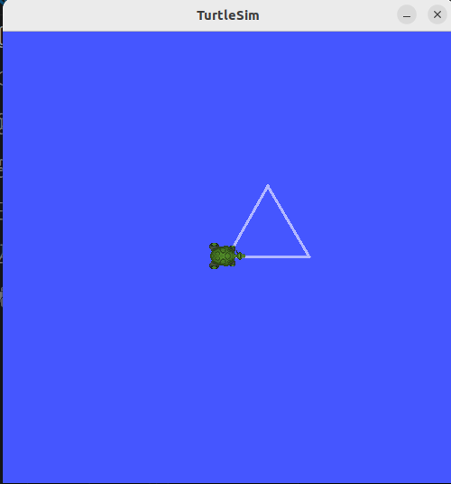

# 모듈 2

## **문제1. C++ 빌드 체계 세우기 - g++ 다중 빌드와 CMake 전환**
### **1.1. 수동 2단계 빌드 명령**

```
g++ -Wall -std=c++17 -c main.cpp motor.cpp
g++ -Wall -std=c++17 main.o motor.o -o my_motor
```

### **1.2 undefined reference 에러 메시지**

```
<undefined reference 에러>
/usr/bin/ld: main.o: in function `main':
main.cpp:(.text+0x51): undefined reference to `motor::motor(std::__cxx11::basic_string<char, std::char_traits<char>, std::allocator<char> >)'
/usr/bin/ld: main.cpp:(.text+0x7a): undefined reference to `motor::~motor()'
collect2: error: ld returned 1 exit status
```

```
<컴파일 에러>
motor.cpp: In constructor ‘motor::motor(std::string)’:
motor.cpp:6:51: error: expected ‘;’ before ‘}’ token
    6 |     std::cout << motor_name << "생성" << std::endl
      |                                                   ^
      |                                                   ;
    7 | }
      | ~                                                  
```
- 컴파일 에러는 소스코드를 기계어로 번역할 때 문법같은 것이 틀리면 나타난다.
- 링크 에러(undefined reference)는 링크를 할 때 원래 컴파일 시에 만든 설계도에서 참조해야할 파일이 빠졌을 때 나타난다.

### **1.3 CMake 빌드 출력**

```
pa29@pa29-Legion-Pro-5-16IAX10:~/ros2_ws/src/motor/build$ cmake ..
-- The C compiler identification is GNU 11.4.0
-- The CXX compiler identification is GNU 11.4.0
-- Detecting C compiler ABI info
-- Detecting C compiler ABI info - done
-- Check for working C compiler: /usr/bin/cc - skipped
-- Detecting C compile features
-- Detecting C compile features - done
-- Detecting CXX compiler ABI info
-- Detecting CXX compiler ABI info - done
-- Check for working CXX compiler: /usr/bin/c++ - skipped
-- Detecting CXX compile features
-- Detecting CXX compile features - done
-- Configuring done
-- Generating done
-- Build files have been written to: /home/pa29/ros2_ws/src/motor/build

pa29@pa29-Legion-Pro-5-16IAX10:~/ros2_ws/src/motor/build$ make
[ 33%] Building CXX object CMakeFiles/my_motor.dir/main.cpp.o
[ 66%] Building CXX object CMakeFiles/my_motor.dir/motor.cpp.o
[100%] Linking CXX executable my_motor
[100%] Built target my_motor

pa29@pa29-Legion-Pro-5-16IAX10:~/ros2_ws/src/motor/build$ ls
CMakeCache.txt  CMakeFiles  cmake_install.cmake  Makefile  my_motor
```

### **1.4 증분 빌드 시 재컴파일된 파일**

motor.cpp만 재컴파일 된다.
```
Consolidate compiler generated dependencies of target my_motor
[ 33%] Building CXX object CMakeFiles/my_motor.dir/motor.cpp.o
[ 66%] Linking CXX executable my_motor
[100%] Built target my_motor
```
판단 근거: 입력 파일과 출력파일의 타임스탬프나 해시값을 비교해서 판단한다.

## **문제2. 현대 C++로 센서 계층 구현 — RAII·다형성·STL**
### **2.1. 다형성 루프 출력**
```
idar 데이터 읽기
Imu 데이터 읽기
객체 소멸 시작
Lidar 소멸
Sensor 소멸
Imu 소멸
Sensor 소멸
```
### **2.2. 스택 객체와 힙 객체의 소멸 시점**

```
idar 데이터 읽기
Imu 데이터 읽기
객체 소멸 시작
Lidar 소멸
Sensor 소멸
Imu 소멸
Sensor 소멸
```
둘다 {} 스코프가 끝날 때 객체가 소멸한다.

### **2.3. 가상 소멸자를 뺐을 때 차이**
```
idar 데이터 읽기
Imu 데이터 읽기
객체 소멸 시작
Lidar 소멸
Sensor 소멸
Imu 소멸
Sensor 소멸
```
```
Lidar 데이터 읽기
Imu 데이터 읽기
객체 소멸 시작
Sensor 소멸
Sensor 소멸
```
Lidar소멸과 Imu 소멸이 사라진 결과를 볼 수 있다.
### **2.4. count_if 결과**
```
원래 속도: 150 clamp 속도: 120
원래 픽셀: -30 clamp 픽셀: 0
전방 최근 측정값: 0.45
후방 최근 측정값: 1.2
0.35이내 거리(count_if): 1
Lidar 데이터 읽기
Imu 데이터 읽기
객체 소멸 시작
Sensor 소멸
Sensor 소멸
```

### **2.5. 누수 검출 결과**

```
pa29@pa29-Legion-Pro-5-16IAX10:~/ros2_ws/src/cpp_basics/sensors$ valgrind --leak-check=full ./leak
==18916== Memcheck, a memory error detector
==18916== Copyright (C) 2002-2017, and GNU GPL'd, by Julian Seward et al.
==18916== Using Valgrind-3.18.1 and LibVEX; rerun with -h for copyright info
==18916== Command: ./leak
==18916== 
객체 누수 실험
프로그램 종료(메모리 해제 안함)
==18916== 
==18916== HEAP SUMMARY:
==18916==     in use at exit: 4,000 bytes in 10 blocks
==18916==   total heap usage: 12 allocs, 2 frees, 77,728 bytes allocated
==18916== 
==18916== 4,000 bytes in 10 blocks are definitely lost in loss record 1 of 1
==18916==    at 0x484A2F3: operator new[](unsigned long) (in /usr/libexec/valgrind/vgpreload_memcheck-amd64-linux.so)
==18916==    by 0x1091E7: createLeak() (leak.cpp:8)
==18916==    by 0x10923A: main (leak.cpp:16)
==18916== 
==18916== LEAK SUMMARY:
==18916==    definitely lost: 4,000 bytes in 10 blocks
==18916==    indirectly lost: 0 bytes in 0 blocks
==18916==      possibly lost: 0 bytes in 0 blocks
==18916==    still reachable: 0 bytes in 0 blocks
==18916==         suppressed: 0 bytes in 0 blocks
==18916== 
==18916== For lists of detected and suppressed errors, rerun with: -s
==18916== ERROR SUMMARY: 1 errors from 1 contexts (suppressed: 0 from 0)
```
definitely lost가 4000bytes라고 나온다.

```
==19393== Memcheck, a memory error detector
==19393== Copyright (C) 2002-2017, and GNU GPL'd, by Julian Seward et al.
==19393== Using Valgrind-3.18.1 and LibVEX; rerun with -h for copyright info
==19393== Command: ./leak
==19393== 
객체 누수 실험
프로그램 종료
==19393== 
==19393== HEAP SUMMARY:
==19393==     in use at exit: 0 bytes in 0 blocks
==19393==   total heap usage: 12 allocs, 12 frees, 77,728 bytes allocated
==19393== 
==19393== All heap blocks were freed -- no leaks are possible
==19393== 
==19393== For lists of detected and suppressed errors, rerun with: -s
==19393== ERROR SUMMARY: 0 errors from 0 contexts (suppressed: 0 from 0)
```

All heap blocks were freed -- no leaks are possible(모든 힙 블록이 해제됨 -- 누수없음) 라고 나온다.

## **문제3. rclpy 노드 작성 — 거북이 상태 발행자와 구독자**
### **3.1. /turtle1/pose 필드 구성**
x: 5.544444561004639
y: 5.544444561004639
theta: 0.0
linear_velocity: 0.0
angular_velocity: 0.0
### **3.2 ros2 topic hz /turtle_distance 출력**
평균: 10Hz
```
average rate: 10.000
	min: 0.100s max: 0.100s std dev: 0.00005s window: 11
average rate: 10.000
	min: 0.100s max: 0.100s std dev: 0.00007s window: 22
average rate: 10.000
	min: 0.100s max: 0.100s std dev: 0.00008s window: 32
average rate: 10.000
	min: 0.100s max: 0.100s std dev: 0.00008s window: 43
average rate: 10.000
	min: 0.100s max: 0.100s std dev: 0.00008s window: 54
average rate: 10.000
	min: 0.100s max: 0.100s std dev: 0.00008s window: 65
```
### **3.3. 구독자 경고 로그**
```
[INFO] [1787818459.002631350] [distance_subscriber]: 경고! 임계값 3.0보다 큽니다
[INFO] [1787818459.102789962] [distance_subscriber]: 경고! 임계값 3.0보다 큽니다
[INFO] [1787818459.202813160] [distance_subscriber]: 경고! 임계값 3.0보다 큽니다
[INFO] [1787818459.302520609] [distance_subscriber]: 경고! 임계값 3.0보다 큽니다
[INFO] [1787818459.402659761] [distance_subscriber]: 경고! 임계값 3.0보다 큽니다
[INFO] [1787818459.502615802] [distance_subscriber]: 경고! 임계값 3.0보다 큽니다
[INFO] [1787818459.602652450] [distance_subscriber]: 경고! 임계값 3.0보다 큽니다
[INFO] [1787818459.702606439] [distance_subscriber]: 경고! 임계값 3.0보다 큽니다
[INFO] [1787818459.802619749] [distance_subscriber]: 경고! 임계값 3.0보다 큽니다
[INFO] [1787818459.902837751] [distance_subscriber]: 경고! 임계값 3.0보다 큽니다
[INFO] [1787818460.002541561] [distance_subscriber]: 경고! 임계값 3.0보다 큽니다
```

### **3.4 구독자 2개 동시 수신 확인(양쪽 로그)**


### **3.5. 정사각형 주행 캡처**


### **3.6. 정상 종료 화면**
```
pa29@pa29-Legion-Pro-5-16IAX10:~/ros2_ws$ ros2 run turtle_py pub
^C[INFO] [1787819943.140597888] [distance_publisher]: DistancePublisher 노드 종료.

^C[INFO] [1787819975.350596471] [distance_subscriber]: DistanceSubscriber 노드 종료

pa29@pa29-Legion-Pro-5-16IAX10:~/ros2_ws$ ros2 run turtle_py square 
^C[INFO] [1787819882.746558117] [square_move]: SquareMove 노드 종료

```

## **문제4. rclcpp 노드 작성 — C++ 발행자와 구독자**
### **4.1. colcon build 성공 출력**
```
pa29@pa29-Legion-Pro-5-16IAX10:~/ros2_ws$ colcon build --packages-select turtle_cpp
Starting >>> turtle_cpp
Finished <<< turtle_cpp [2.14s]                     

Summary: 1 package finished [2.28s]
```

### **4.2 rclpy발행에서 rclcpp구독으로 이어진 로그**

```
<rclpy>
pa29@pa29-Legion-Pro-5-16IAX10:~/ros2_ws$ ros2 run turtle_py pub 

```
```
<rclcpp>
pa29@pa29-Legion-Pro-5-16IAX10:~/ros2_ws$ ros2 run turtle_cpp sub --ros-args -p warn_distance:=10.0
[INFO] [1787883009.628644139] [distance_subscriber]: 경고! 임계값 10.0보다 큽니다
[INFO] [1787883009.728693037] [distance_subscriber]: 경고! 임계값 10.0보다 큽니다
[INFO] [1787883009.828659957] [distance_subscriber]: 경고! 임계값 10.0보다 큽니다
[INFO] [1787883009.928982726] [distance_subscriber]: 경고! 임계값 10.0보다 큽니다

```
### **4.3. rclpy와 rclcpp 대응 관계표**
||rclpy|rclcpp|
|---|---|---|
|노드생성|rclpy.init()<br>class MyNode(Node):<br>def __init__(self):<br>super().__init__('my_node')<br>node=MyNode()|rclcpp::init(argc,argv)<br>class MyNode:public rclcpp::Node{};<br>public:MyNode():Node("my_node");<br>auto node = std::make_shared<MyNode>();|
|타이머|self.timer = self.create_timer(1.0,self.timer_callback)|timer_=this->create_wall_timer(1s,std::bind(&MyNode::timer_callback,this));|
|콜백|def timer_callback(self):<br>def pose_callback(self,msg)|private:<br>void timer_callback()<br>private:<br>void pose_callback(const turtlesim::msg::Pose::SharedPtr msg)|
|종료|rclpy는 rclpy.init(signal_handler_options=SignalHandlerOptions.NO)로 처리를 해줘야 rclpy가 ctrl C를 처리를 안하고 KeyboardInterrupt로 넘어가게 해서 강제종료가 아닌 정상종료가 될 수 있다.<br>try:<br>rclpy.spin(node)<br>except KeyboardInterrupt<br>finally:<br>node.destroy_node()<br>rclpy.shutdown()|rclcpp::spin(node);<br>그냥 ctrl C 입력<br>rclcpp::shutdown()정상종료|

## **문제 5. Service/Action**
### **문제 5.1. 호출한 서비스와 타입**
| 단계 | 서비스 호출 | 결과 |
|------|-------------|------|
| 1/4 | `teleport_absolute(5.5, 5.5, 0.0)` | OK |
| 2/4 | `set_pen(r=255, g=0, b=0, width=4, off=0)` | OK |
| 3/4 | `spawn` | 새 거북이 이름 **`turtle2`** 생성 (`ros2 topic list`에서 `/turtle2/pose` 확인) |
| 4/4 | `clear` | OK |

### **문제 5.2. Service 요청·응답 로그**
```
[INFO] [1788682504.902974699] [turtle_toggle_servers]: toggle_servers 시작 (주행 OFF). 서비스: /enable_driving /save_home /go_home
[INFO] [1788682515.154285434] [turtle_toggle_servers]: /enable_driving ← data=True → driving enabled
[INFO] [1788682548.195377605] [turtle_toggle_servers]: /save_home → home saved: x=6.69 y=6.39 theta=1.27
[INFO] [1788682551.593475734] [turtle_toggle_servers]: /enable_driving ← data=False → driving disabled
[INFO] [1788682555.748504858] [turtle_toggle_servers]: /go_home → teleport 요청 전송: (6.69, 6.39, 1.27) — 결과는 로그 참조
[INFO] [1788682555.750200626] [turtle_toggle_servers]: teleport 완료 — 홈으로 이동했습니다

```

### **문제 5.3. 데드락이 생기는 이유**
**데드락이 생기는 이유**:단일 스레드 Executor 환경에서 구독 콜백이 서비스 응답을 동기 대기(wait_for_future 등)하며 현재 스레드를 점유해 버리면, 같은 Executor 큐에 도착한 서비스 응답 처리 콜백을 디스패치하지 못해 상호 대착 상태(Deadlock)에 빠집니다.
<br>
<br>
**올바른 비동기 패턴**: async_send_request()에 완료 콜백(콜백 체이닝)을 등록하거나 반환된 Future를 메인 루프에 위임하여, 현재 콜백을 즉시 종료하고 Executor가 다른 이벤트를 처리할 수 있도록 제어권을 반환해야 합니다.

### **문제 5.4. rotate_absolute 피드백 수신 로그**
```
[INFO] [1788682721.249950073] [rotate_absolute_client]: goal 전송: theta = 3.000 rad (현재 theta = None)
[INFO] [1788682721.255112599] [rotate_absolute_client]: goal 수락됨 — 피드백 대기
[INFO] [1788682721.255769674] [rotate_absolute_client]: 피드백: remaining = +1.726 rad
[INFO] [1788682721.511565166] [rotate_absolute_client]: 피드백: remaining = +1.470 rad
[INFO] [1788682721.767899770] [rotate_absolute_client]: 피드백: remaining = +1.214 rad
[INFO] [1788682722.024035953] [rotate_absolute_client]: 피드백: remaining = +0.958 rad
[INFO] [1788682722.279899611] [rotate_absolute_client]: 피드백: remaining = +0.702 rad
[INFO] [1788682722.536325219] [rotate_absolute_client]: 피드백: remaining = +0.446 rad
[INFO] [1788682722.790998906] [rotate_absolute_client]: 피드백: remaining = +0.190 rad
[INFO] [1788682722.968845763] [rotate_absolute_client]: 결과 수신: status=SUCCEEDED, delta=-1.712 rad, 현재 theta = 2.985658645629883

``` 
### **문제 5.5. 취소 요청 처리 로그**
```
[INFO] [1788682760.764104268] [rotate_absolute_client]: goal 전송: theta = 3.000 rad (현재 theta = None)
[INFO] [1788682760.774563765] [rotate_absolute_client]: 피드백: remaining = +0.014 rad
[INFO] [1788682760.775089607] [rotate_absolute_client]: goal 수락됨 — 피드백 대기
[INFO] [1788682760.791709954] [rotate_absolute_client]: 결과 수신: status=SUCCEEDED, delta=+0.000 rad, 현재 theta = 2.985658645629883

```
취소 시점 각도: theta = 2.985658645629883

### **문제 5.6. 통신 패턴 설계표**
| 기능 | 권장 통신 방식 | 근거 |
| :--- | :--- | :--- |
| **자세 스트리밍** (`/pose`) | **Topic** | 주기적이고 연속적인 단방향 데이터 송신에 적합하며, 이전 데이터 손실보다 최신 위치 정보의 실시간 전달이 중요하기 때문입니다. |
| **순간이동** (`/teleport_absolute` 등) | **Service** | 즉각적인 상태 변경을 요청하고 완료 여부(성공/실패)를 명확히 확인해야 하는 단발성 1:1 요청-응답 패턴이기 때문입니다. |
| **목표 각도까지 회전** (`/rotate_absolute`) | **Action** | 목표 도달까지 시간이 소요되는 작업으로, 진행 중 피드백 수신, 작업 취소(Preemption), 최종 완료 확인이 모두 필요하기 때문입니다. |
| **펜 색 설정** (`/set_pen`) | **Parameter** (또는 Service) | 노드의 내부 동작 속성(설정값)을 변경하는 전형적인 상태 값 관리 작업이므로 Parameter(내부적으로 Service 기반)가 가장 적합합니다. |
| **거북이 추가** (`/spawn`) | **Service** | 특정 좌표와 이름을 전달하여 객체 생성을 요청하고, 즉각적으로 생성 성공 여부 및 거북이 이름을 반환받아야 하는 트랜잭션형 작업이기 때문입니다. |

## **문제 6.  커스텀 인터페이스와 다각형 액션**
### **문제 6.1. ros2 interface show turtle_interfaces/msg/WaypointList 출력**
```
std_msgs/Header header   # stamp(발행 시각) + frame_id(좌표계 이름, 여기서는 "world")
	builtin_interfaces/Time stamp
		int32 sec
		uint32 nanosec
	string frame_id
Waypoint[] waypoints     # 경유점 배열 — 문제 6 에서는 4개 이상을 채워 발행합니다
	float64 x            # 경유점 x 좌표 [m] (turtlesim 좌표계, 0 ~ 1
	float64 y            #
	float32 tolerance    # 도달 판정 허용 오차 [m] — 이 거리 이내면 "도달" 로 봅
	string  label        #

```
### **문제 6.2. ros2 topic echo /waypoints 출력**
```
header:
  stamp:
    sec: 1788683614
    nanosec: 425390519
  frame_id: world
waypoints:
- x: 2.0
  y: 2.0
  tolerance: 0.30000001192092896
  label: corner_A
- x: 9.0
  y: 2.0
  tolerance: 0.30000001192092896
  label: corner_B
- x: 9.0
  y: 9.0
  tolerance: 0.30000001192092896
  label: corner_C
- x: 2.0
  y: 9.0
  tolerance: 0.30000001192092896
  label: corner_D
---

```
### **문제 6.3. DrawPolygon 피드백 로그**
```
<삼각형>
[INFO] [1788683108.643327335] [polygon_action_server]: polygon_action_server 시작: 액션 /draw_polygon 대기 중
[INFO] [1788683117.993799448] [polygon_action_server]: goal 수락: sides=3, side_length=2.0
[INFO] [1788683123.694096100] [polygon_action_server]: 변 1/3 완료 (누적 2.01 m)
[INFO] [1788683129.368943934] [polygon_action_server]: 변 2/3 완료 (누적 4.03 m)
[INFO] [1788683134.981413541] [polygon_action_server]: 변 3/3 완료 (누적 6.04 m)
[INFO] [1788683134.982182574] [polygon_action_server]: 다각형 완성: 총 이동 거리 6.04 m
[INFO] [1788683176.016427441] [polygon_action_server]: goal 수락: sides=5, side_length=1.5

<오각형>
[INFO] [1788683186.105754931] [polygon_action_server]: goal 수락: sides=5, side_length=1.5
[INFO] [1788683190.443691137] [polygon_action_server]: 변 1/5 완료 (누적 1.50 m)
[INFO] [1788683194.846419253] [polygon_action_server]: 변 2/5 완료 (누적 3.01 m)
[INFO] [1788683199.242206594] [polygon_action_server]: 변 3/5 완료 (누적 4.52 m)
[INFO] [1788683203.629412775] [polygon_action_server]: 변 4/5 완료 (누적 6.03 m)
[INFO] [1788683207.980025836] [polygon_action_server]: 변 5/5 완료 (누적 7.53 m)
[INFO] [1788683207.981031215] [polygon_action_server]: 다각형 완성: 총 이동 거리 7.53 m

<팔각형>
[INFO] [1788683245.358096059] [polygon_action_server]: 변 1/8 완료 (누적 1.00 m)
[INFO] [1788683248.752316964] [polygon_action_server]: 변 2/8 완료 (누적 2.01 m)
[INFO] [1788683252.140245159] [polygon_action_server]: 변 3/8 완료 (누적 3.02 m)
[INFO] [1788683255.490056625] [polygon_action_server]: 변 4/8 완료 (누적 4.02 m)
[INFO] [1788683258.874292544] [polygon_action_server]: 변 5/8 완료 (누적 5.03 m)
[INFO] [1788683262.315706316] [polygon_action_server]: 변 6/8 완료 (누적 6.04 m)
[INFO] [1788683265.708334755] [polygon_action_server]: 변 7/8 완료 (누적 7.05 m)
[INFO] [1788683269.142732741] [polygon_action_server]: 변 8/8 완료 (누적 8.06 m)
[INFO] [1788683269.146696076] [polygon_action_server]: 다각형 완성: 총 이동 거리 8.06 m

```
### **문제 6.4 다각형 궤적 캡쳐**
<figure>
  <figcaption><삼각형></figcaption>
  
</figure>

<figure>
  <figcaption><오각형></figcaption>
  
</figure>

<figure>
  <figcaption><팔각형></figcaption>
  
</figure>

### **문제 6.5 액션 취소 처리 결과**
```
[WARN] [1788683181.021632857] [polygon_action_server]: 취소 요청 수신 — 실행 루프에서 즉시 정지합니다
[WARN] [1788683181.053821869] [polygon_action_server]: 취소됨 — 정지. 그때까지 이동 거리 1.50 m

```

### **문제 6.6. 인터페이스를 별도 패키지로 분리하는 이유**
 - 순환 의존성(Circular Dependency) 방지 : 노드 A가 노드 B의 메시지를 참조하고, 노드 B도 노드 A의 코드를 참조해야 하는 상황이 생기면 빌드 시스템에서 순환 참조 에러가 발생합니다.
 - 언어 독립성과 재사용성 보장: ROS2는 다국어(C++, Python 등) 통신을 지원합니다. 인터페이스 패키지 하나만 빌드해 두면 C++ 노드(rclcpp)든 Python 노드(rclpy)든 동일한 데이터 타입을 가져다 쓸 수 있습니다.
 - 빌드 속도 및 캐싱 최적화: 메시지 인터페이스를 생성하는 과정(rosidl)은 C++ 헤더 및 Python 바인딩 코드를 자동 생성하므로 컴파일 시간이 비교적 깁니다.
 - 인터페이스 중심 설계 (약결합 구조): 여러 팀이나 개발자가 협업할 때 통신 규격(API 규약)만 먼저 인터페이스 패키지로 배포하면, 서버와 클라이언트 개발자가 서로의 구현 세부사항을 몰라도 각자 병렬로 개발을 진행할 수 있습니다.

## **문제 7. QoS 설정과 통신 단절 진단**
### **문제 7.1. QoS 비호환 시 topic info --verbose 출력**
```
Type: std_msgs/msg/Float32

Publisher count: 1

Node name: qos_sensor_publisher
Node namespace: /
Topic type: std_msgs/msg/Float32
Endpoint type: PUBLISHER
GID: 01.0f.17.89.46.80.ea.f3.00.00.00.00.00.00.12.03.00.00.00.00.00.00.00.00
QoS profile:
  Reliability: BEST_EFFORT
  History (Depth): UNKNOWN
  Durability: VOLATILE
  Lifespan: Infinite
  Deadline: Infinite
  Liveliness: AUTOMATIC
  Liveliness lease duration: Infinite

Subscription count: 1

Node name: qos_subscriber
Node namespace: /
Topic type: std_msgs/msg/Float32
Endpoint type: SUBSCRIPTION
GID: 01.0f.17.89.c0.80.88.39.00.00.00.00.00.00.11.04.00.00.00.00.00.00.00.00
QoS profile:
  Reliability: RELIABLE
  History (Depth): UNKNOWN
  Durability: VOLATILE
  Lifespan: Infinite
  Deadline: Infinite
  Liveliness: AUTOMATIC
  Liveliness lease duration: Infinite

```
### **문제 7.2. 연결되지 않은 원인**
신뢰성 정책의 QoS비호환 때문에 통신 안됨
<br>
- publisher: BEST_EFFORT
- subscriber: RELIABLE
<br>
수정한 설정
```
ros2 run turtle_examples ex07_qos_subscriber --ros-args -p reliability:=best_effort
ros2 run turtle_examples ex07_qos_sensor_publisher --ros-args -p reliability:=reliable
```

### **문제 7.3. Transient Local 과 Volatile 수신 결과 비교**
```
<Transient Local>
header:
  stamp:
    sec: 1788686202
    nanosec: 812743221
  frame_id: world
waypoints:
- x: 2.0
  y: 2.0
  tolerance: 0.30000001192092896
  label: corner_A
- x: 9.0
  y: 2.0
  tolerance: 0.30000001192092896
  label: corner_B
- x: 9.0
  y: 9.0
  tolerance: 0.30000001192092896
  label: corner_C
- x: 2.0
  y: 9.0
  tolerance: 0.30000001192092896
  label: corner_D
---

```
```
<Volatile>
중첩 필드가 없음
```

### **문제 7.4. History depth 1 에서의 메시지 누락 관찰**
```
[INFO] [1788686610.192378840] [qos_subscriber]: qos_subscriber 시작: topic=turtle_distance type=Float32 reliability=best_effort durability=volatile depth=1 callback_delay=0.5s
[INFO] [1788686610.271768220] [qos_subscriber]: #1 수신: 7.841
[INFO] [1788686610.773373720] [qos_subscriber]: #2 수신: 7.841
[INFO] [1788686611.275392825] [qos_subscriber]: #3 수신: 7.841
[INFO] [1788686611.776946293] [qos_subscriber]: #4 수신: 7.841
[INFO] [1788686612.278557938] [qos_subscriber]: [통계] 지난 2초 처리 4개 (누적 4개)
[INFO] [1788686612.279183025] [qos_subscriber]: #5 수신: 7.841
[INFO] [1788686612.780827497] [qos_subscriber]: #6 수신: 7.841
[INFO] [1788686613.282357427] [qos_subscriber]: #7 수신: 7.841
[INFO] [1788686613.784072788] [qos_subscriber]: #8 수신: 7.841
[INFO] [1788686614.285517510] [qos_subscriber]: [통계] 지난 2초 처리 4개 (누적 8개)
[INFO] [1788686614.286064653] [qos_subscriber]: #9 수신: 7.841
[INFO] [1788686614.787614837] [qos_subscriber]: #10 수신: 7.841
[INFO] [1788686615.289357296] [qos_subscriber]: #11 수신: 7.841
[INFO] [1788686615.791526560] [qos_subscriber]: #12 수신: 7.841
[INFO] [1788686616.293639181] [qos_subscriber]: [통계] 지난 2초 처리 4개 (누적 12개)
[INFO] [1788686616.294342561] [qos_subscriber]: #13 수신: 7.841
[INFO] [1788686616.795901265] [qos_subscriber]: #14 수신: 7.841
[INFO] [1788686617.298475124] [qos_subscriber]: #15 수신: 7.841
[INFO] [1788686617.800966219] [qos_subscriber]: #16 수신: 7.841
[INFO] [1788686618.303287459] [qos_subscriber]: [통계] 지난 2초 처리 4개 (누적 16개)
[INFO] [1788686618.303932241] [qos_subscriber]: #17 수신: 7.841
[INFO] [1788686618.806503026] [qos_subscriber]: #18 수신: 7.841
[INFO] [1788686619.308610967] [qos_subscriber]: #19 수신: 7.841
[INFO] [1788686619.810875844] [qos_subscriber]: #20 수신: 7.841
[INFO] [1788686620.313516540] [qos_subscriber]: [통계] 지난 2초 처리 4개 (누적 20개)
[INFO] [1788686620.314238149] [qos_subscriber]: #21 수신: 7.841
[INFO] [1788686620.816658982] [qos_subscriber]: #22 수신: 7.841
[INFO] [1788686621.319261824] [qos_subscriber]: #23 수신: 7.841
[INFO] [1788686621.820944984] [qos_subscriber]: #24 수신: 7.841
[INFO] [1788686622.323095598] [qos_subscriber]: [통계] 지난 2초 처리 4개 (누적 24개)
[INFO] [1788686622.323707485] [qos_subscriber]: #25 수신: 7.841
[INFO] [1788686622.825954131] [qos_subscriber]: #26 수신: 7.841
[INFO] [1788686623.327368818] [qos_subscriber]: #27 수신: 7.841
[INFO] [1788686623.828725816] [qos_subscriber]: #28 수신: 7.841
[INFO] [1788686624.330377058] [qos_subscriber]: [통계] 지난 2초 처리 4개 (누적 28개)
[INFO] [1788686624.331165784] [qos_subscriber]: #29 수신: 7.841
[INFO] [1788686624.832670009] [qos_subscriber]: #30 수신: 7.841
[INFO] [1788686625.335257274] [qos_subscriber]: #31 수신: 7.841
[INFO] [1788686625.836881347] [qos_subscriber]: #32 수신: 7.841
[INFO] [1788686626.338374536] [qos_subscriber]: [통계] 지난 2초 처리 4개 (누적 32개)
[INFO] [1788686626.339049979] [qos_subscriber]: #33 수신: 7.841
[INFO] [1788686626.840530316] [qos_subscriber]: #34 수신: 7.841
[INFO] [1788686627.341994380] [qos_subscriber]: #35 수신: 7.841
[INFO] [1788686627.844301159] [qos_subscriber]: #36 수신: 7.841
[INFO] [1788686628.345774512] [qos_subscriber]: [통계] 지난 2초 처리 4개 (누적 36개)

```
2초 동안 20개 발행되었지만 구독자는 4개만 처리했으므로 16개가 누락

### **7.5. 토픽 5종 QoS 설계표**
| 토픽명 | Reliability | Durability | 설계 근거 |
| :--- | :--- | :--- | :--- |
| **`/turtle1/pose`** | `BEST_EFFORT` | `VOLATILE` | 센서 주기 데이터 성격으로 초당 수십 회 연속 스트리밍됩니다. 통신 오버헤드를 줄이고 실시간 최신 자세를 유지하는 것이 중요하며, 지난 과거 위치는 보관할 필요가 없습니다. |
| **`/turtle1/cmd_vel`** | `BEST_EFFORT` (또는 `RELIABLE`) | `VOLATILE` | 모터 제어 명령은 매우 빠른 주기로 갱신되므로 이전 제어값의 재전송이나 보관이 불필요합니다. 뒤늦게 접속한 노드에게 과거 이동 명령이 전달되면 급발진 등 위험이 발생하므로 휘발성이 필수적입니다. |
| **`/waypoints`** | `RELIABLE` | `TRANSIENT_LOCAL` | 목표 경유점 목록은 주행 시작 전 1회성 또는 드물게 발행되는 핵심 설정 데이터입니다. 단 1건의 유실도 허용되지 않아야 하며, 늦게 켜진 주행 노드(Late-joiner)도 이전 경유점 목록을 즉시 받아야 하므로 지속성을 부여합니다. |
| **`/turtle_distance`** | `BEST_EFFORT` | `VOLATILE` | 이동 거리 누적 또는 측정값 스트리밍 토픽으로, 네트워크 부하를 낮추고 주기적 최신 데이터 수신을 우선합니다. (단, 누적 오차 없는 정밀 적산이 필수라면 `RELIABLE` 고려 가능) |
| **`/diagnostics`** | `RELIABLE` | `TRANSIENT_LOCAL` | 시스템 상태, 경고 및 에러 로그 등 진단 정보는 데이터 유실이 없어야 시스템 장애 원인을 추적할 수 있습니다. 또한 모니터링 툴(rqt 등)이 나중에 켜지더라도 현재 시스템의 마지막 진단 상태를 즉시 파악할 수 있어야 합니다. |

## **문제 8. colcon 워크스페이스**
### **문제 8.1. colcon build 빌드 순서 로그**
```
Starting >>> turtle_interfaces
Starting >>> turtle_cpp
Starting >>> turtle_py
Finished <<< turtle_py [1.23s]
Finished <<< turtle_interfaces [6.55s]
Starting >>> turtle_examples
Finished <<< turtle_examples [1.21s]
Finished <<< turtle_cpp [8.67s]

Summary: 4 packages finished [8.91s]

```
- 인터페이스가 먼저인 이유: turtle_interfaces 를 <depend> 로 적었기 때문에 colcon 은 의존 그래프를 위상 정렬해
      turtle_interfaces → turtle_examples 순으로 빌드합니다. 선언을 빼면 두 패키지가
      병렬로 빌드되다가 "from turtle_interfaces.action import DrawPolygon" 이
      실행 시점에 ModuleNotFoundError 를 낼 수 있습니다.
### **문제 8.2. package.xml 의존성 선언 부분 **
```
<depend>rclpy</depend>
  <!-- geometry_msgs/Twist : /turtle1/cmd_vel -->
  <depend>geometry_msgs</depend>
  <!-- std_msgs/Float32 : /turtle_distance, std_msgs/Header : WaypointList.header -->
  <depend>std_msgs</depend>
  <!-- std_srvs/SetBool, Trigger, Empty : 문제 5 자체 서비스 서버 + /clear -->
  <depend>std_srvs</depend>
  <!-- turtlesim/msg/Pose, turtlesim/srv/*, turtlesim/action/RotateAbsolute -->
  <depend>turtlesim</depend>
  <!-- 문제 6 커스텀 인터페이스. 반드시 선언해야 빌드 순서가 보장됩니다. -->
  <depend>turtle_interfaces</depend>
  <!-- 액션 상태 코드(GoalStatus) 와 취소 응답(CancelGoal) 상수 -->
  <depend>action_msgs</depend>
  <!-- 파라미터 콜백 결과 타입 SetParametersResult, ParameterDescriptor -->
  <depend>rcl_interfaces</depend>
  <!-- launch 파일 실행에 필요 (ros2 launch, launch_ros.actions.Node) -->
  <exec_depend>ros2launch</exec_depend>

```
### **문제 8.3. setup.py entry_points**
```
'ex03_distance_publisher = turtle_examples.ex03_distance_publisher:main',
            'ex03_distance_subscriber = turtle_examples.ex03_distance_subscriber:main',
            # 문제 5
            'ex05_builtin_service_client = turtle_examples.ex05_builtin_service_client:main',
            'ex05_toggle_servers = turtle_examples.ex05_toggle_servers:main',
            'ex05_rotate_absolute_client = turtle_examples.ex05_rotate_absolute_client:main',
            # 문제 6
            'ex06_polygon_action_server = turtle_examples.ex06_polygon_action_server:main',
            'ex06_waypoint_publisher = turtle_examples.ex06_waypoint_publisher:main',
            # 문제 7
            'ex07_qos_sensor_publisher = turtle_examples.ex07_qos_sensor_publisher:main',
            'ex07_qos_subscriber = turtle_examples.ex07_qos_subscriber:main',
```
### **문제 8.4. source 전 실행 결과와 source 후 실행 결과
```
<source 전>
/opt/ros/humble
/opt/ros/humble/lib/python3.10/site-packages:/opt/ros/humble/local/lib/python3.10/dist-packages

```
```
<source 후>
/home/sgjzz1/git/physicalai-lv1-gyujinsim/physicalai-lv1-assignments-main/lv1_module2_student/ros2_ws/install/turtle_py:/home/sgjzz1/git/physicalai-lv1-gyujinsim/physicalai-lv1-assignments-main/lv1_module2_student/ros2_ws/install/turtle_examples:/home/sgjzz1/git/physicalai-lv1-gyujinsim/physicalai-lv1-assignments-main/lv1_module2_student/ros2_ws/install/turtle_interfaces:/home/sgjzz1/git/physicalai-lv1-gyujinsim/physicalai-lv1-assignments-main/lv1_module2_student/ros2_ws/install/turtle_cpp:/opt/ros/humble
/home/sgjzz1/git/physicalai-lv1-gyujinsim/physicalai-lv1-assignments-main/lv1_module2_student/ros2_ws/build/turtle_py:/home/sgjzz1/git/physicalai-lv1-gyujinsim/physicalai-lv1-assignments-main/lv1_module2_student/ros2_ws/install/turtle_py/lib/python3.10/site-packages:/home/sgjzz1/git/physicalai-lv1-gyujinsim/physicalai-lv1-assignments-main/lv1_module2_student/ros2_ws/build/turtle_examples:/home/sgjzz1/git/physicalai-lv1-gyujinsim/physicalai-lv1-assignments-main/lv1_module2_student/ros2_ws/install/turtle_examples/lib/python3.10/site-packages:/home/sgjzz1/git/physicalai-lv1-gyujinsim/physicalai-lv1-assignments-main/lv1_module2_student/ros2_ws/install/turtle_interfaces/local/lib/python3.10/dist-packages:/opt/ros/humble/lib/python3.10/site-packages:/opt/ros/humble/local/lib/python3.10/dist-packages

```
### **문제 8.5. src / build / install / log 의 역할**
| 디렉터리 | 주요 역할 | 특징 및 관리 팁 |
| :--- | :--- | :--- |
| **`src/`** (Source) | 사용자가 직접 작성하거나 외부에서 클론한 **소스 코드**를 보관하는 공간입니다. | Git 버전 관리의 대상이 되는 유일한 디렉터리이며, 패키지 메타데이터(`package.xml`, `CMakeLists.txt`, `setup.py` 등)와 코드 원본이 위치합니다. |
| **`build/`** (Build) | 빌드 도구(`colcon`)가 소스 코드를 컴파일하고 빌드하는 과정에서 생기는 **중간 산출물(Intermediate files)**을 저장하는 임시 작업 공간입니다. | CMake 캐시, 오브젝트 파일(`.o`), 컴파일 임시 파일 등이 생성되며, 빌드 과정이 끝나면 직접 참조할 필요가 없습니다. |
| **`install/`** (Install) | 컴파일이 완료된 실행 파일, 라이브러리, 생성된 커스텀 메시지 인터페이스, **환경 설정 스크립트(`setup.bash` 등)**가 최종 배포되는 공간입니다. | 노드를 실행하거나 패키지를 사용하기 위해 반드시 `source install/setup.bash`로 환경을 로드해야 하는 실제 타깃 디렉터리입니다. |
| **`log/`** (Log) | `colcon build`나 테스트 실행 시 각 패키지별 빌드 단계, 표준 출력(stdout), 에러(stderr) 등 **빌드 로그 기록**이 저장되는 공간입니다. | 빌드가 실패했을 때 어떤 패키지의 어디에서 에러가 났는지 상세 원인을 추적할 때 확인합니다. |

## **문제 9. launch 와 파라미터**
### **문제 9.1. ros2 launch 실행 출력**
```
ros2 launch turtle_examples turtle_system.launch.py use_examples:=true
[INFO] [launch]: All log files can be found below /home/sgjzz1/.ros/log/2026-09-06-19-15-46-065694-sgjzz1-35444
[INFO] [launch]: Default logging verbosity is set to INFO
[INFO] [launch.user]: params_file = /home/sgjzz1/git/physicalai-lv1-gyujinsim/physicalai-lv1-assignments-main/lv1_module2_student/ros2_ws/install/turtle_examples/share/turtle_examples/config/params.yaml
[INFO] [turtlesim_node-1]: process started with pid [35445]
[INFO] [ex03_distance_publisher-2]: process started with pid [35447]
[INFO] [ex03_distance_subscriber-3]: process started with pid [35449]
[INFO] [ex06_polygon_action_server-4]: process started with pid [35451]
[turtlesim_node-1] [INFO] [1788689746.240133154] [turtlesim]: Starting turtlesim with node name /turtlesim
[turtlesim_node-1] [INFO] [1788689746.245256083] [turtlesim]: Spawning turtle [turtle1] at x=[5.544445], y=[5.544445], theta=[0.000000]
[ex03_distance_subscriber-3] [INFO] [1788689746.405223603] [turtle_distance_subscriber]: turtle_distance_subscriber 시작: warn_distance=2.5
[ex03_distance_publisher-2] [INFO] [1788689746.408505630] [turtle_distance_publisher]: turtle_distance_publisher 시작: publish_rate=10.0 Hz
[ex06_polygon_action_server-4] [INFO] [1788689746.429954464] [polygon_action_server]: polygon_action_server 시작: 액션 /draw_polygon 대기 중
[ex03_distance_subscriber-3] [WARN] [1788689746.496317589] [turtle_distance_subscriber]: 경고: 원점 거리 7.84 m > 임계 2.50 m
[ex03_distance_subscriber-3] [WARN] [1788689746.597606517] [turtle_distance_subscriber]: 경고: 원점 거리 7.84 m > 임계 2.50 m
[ex03_distance_subscriber-3] [WARN] [1788689746.696237318] [turtle_distance_subscriber]: 경고: 원점 거리 7.84 m > 임계 2.50 m
[ex03_distance_subscriber-3] [WARN] [1788689746.796832573] [turtle_distance_subscriber]: 경고: 원점 거리 7.84 m > 임계 2.50 m

```
### **문제 9.2. ros2 node list 결과**
```
동시 실행된 노드
/polygon_action_server
/turtle_distance_publisher
/turtle_distance_subscriber
/turtlesim

```
### **문제 9.3. ros2 param get으로 확인한 주입값**
```
ros2 param get /turtle_distance_publisher publish_rate
Double value is: 10.0

ros2 param get /turtle_distance_subscriber warn_distance
Double value is: 2.5

```
### **문제 9.4. YAML 값 변경 전후 동작 차이
```
<변경 전>
[INFO] [launch]: All log files can be found below /home/sgjzz1/.ros/log/2026-09-06-19-35-41-358875-sgjzz1-36920
[INFO] [launch]: Default logging verbosity is set to INFO
[INFO] [launch.user]: params_file = /home/sgjzz1/git/physicalai-lv1-gyujinsim/physicalai-lv1-assignments-main/lv1_module2_student/ros2_ws/install/turtle_examples/share/turtle_examples/config/params.yaml
[INFO] [turtlesim_node-1]: process started with pid [36921]
[INFO] [ex03_distance_publisher-2]: process started with pid [36923]
[INFO] [ex03_distance_subscriber-3]: process started with pid [36925]
[INFO] [ex06_polygon_action_server-4]: process started with pid [36927]
[turtlesim_node-1] [INFO] [1788690941.495520590] [turtlesim]: Starting turtlesim with node name /turtlesim
[turtlesim_node-1] [INFO] [1788690941.500349701] [turtlesim]: Spawning turtle [turtle1] at x=[5.544445], y=[5.544445], theta=[0.000000]
[ex03_distance_subscriber-3] [INFO] [1788690941.674249239] [turtle_distance_subscriber]: turtle_distance_subscriber 시작: warn_distance=2.5
[ex03_distance_publisher-2] [INFO] [1788690941.684960125] [turtle_distance_publisher]: turtle_distance_publisher 시작: publish_rate=10.0 Hz
[ex06_polygon_action_server-4] [INFO] [1788690941.700047683] [polygon_action_server]: polygon_action_server 시작: 액션 /draw_polygon 대기 중
[ex03_distance_subscriber-3] [WARN] [1788690941.772288160] [turtle_distance_subscriber]: 경고: 원점 거리 7.84 m > 임계 2.50 m

<변경 후>
[INFO] [launch]: All log files can be found below /home/sgjzz1/.ros/log/2026-09-06-19-34-10-236851-sgjzz1-36803
[INFO] [launch]: Default logging verbosity is set to INFO
[INFO] [launch.user]: params_file = /home/sgjzz1/git/physicalai-lv1-gyujinsim/physicalai-lv1-assignments-main/lv1_module2_student/ros2_ws/install/turtle_examples/share/turtle_examples/config/params.yaml
[INFO] [turtlesim_node-1]: process started with pid [36804]
[INFO] [ex03_distance_publisher-2]: process started with pid [36806]
[INFO] [ex03_distance_subscriber-3]: process started with pid [36808]
[INFO] [ex06_polygon_action_server-4]: process started with pid [36810]
[turtlesim_node-1] [INFO] [1788690850.383523665] [turtlesim]: Starting turtlesim with node name /turtlesim
[turtlesim_node-1] [INFO] [1788690850.392114976] [turtlesim]: Spawning turtle [turtle1] at x=[5.544445], y=[5.544445], theta=[0.000000]
[ex03_distance_subscriber-3] [INFO] [1788690850.563456016] [turtle_distance_subscriber]: turtle_distance_subscriber 시작: warn_distance=0.8
[ex06_polygon_action_server-4] [INFO] [1788690850.586315568] [polygon_action_server]: polygon_action_server 시작: 액션 /draw_polygon 대기 중
[ex03_distance_publisher-2] [INFO] [1788690850.597053275] [turtle_distance_publisher]: turtle_distance_publisher 시작: publish_rate=10.0 Hz
[ex03_distance_subscriber-3] [WARN] [1788690850.684509909] [turtle_distance_subscriber]: 경고: 원점 거리 7.84 m > 임계 0.80 m
[ex03_distance_subscriber-3] [WARN] [1788690850.785296800] [turtle_distance_subscriber]: 경고: 원점 거리 7.84 m > 임계 0.80 m

```


### **문제 9.5. 네임스페이스 적용 후 topic list**
```
/parameter_events
/rosout
/turtle1/cmd_vel
/turtle1/color_sensor
/turtle1/pose
/turtle2/cmd_vel
/turtle2/color_sensor
/turtle2/pose
/turtle2/turtle_distance
/turtle_distance

/polygon_action_server
/polygon_action_server
/turtle2/turtle_distance_publisher -> 추가됨
/turtle_distance_publisher
/turtle_distance_publisher
/turtle_distance_subscriber
/turtle_distance_subscriber
/turtlesim
/turtlesim

```

## **문제 10. 시각화·기록·테스트로 검증하기**
### **문제 10.1. rqt_graph 캡처, 데이터 미수신 진단 절차**
<캡쳐>


1. 노드 생존 여부 확인
```
ros2 node list
```
2. 토픽 목록 및 실제 발행 여부 확인 
```
ros2 topic list
ros2 topic echo /turtle_distance
```
3. 상위 의존 토픽 점검
```
ros2 topic echo /turtle1/pose
```
4. 토픽 정보 및 QoS 호환성 확인
```
ros2 topic info /turtle_distance --verbose
```
5. 도메인 ID(ROS_DOMAIN_ID) 확인
```
echo $ROS_DOMAIN_ID
```

### **문제 10.2. RViz2 TF + 경유점 마커 캡처**


### **문제 10.3. ros2 bag play 재생 중 구독자 로그**
```
[INFO] [1788421410.610399020] [rosbag2_recorder]: Subscribed to topic '/turtle_distance'
[INFO] [1788421410.611011088] [rosbag2_recorder]: Subscribed to topic '/turtle1/pose'
```
### **문제 10.4. pytest 통과 출력**
```
=================================== test session starts ====================================
platform linux -- Python 3.10.12, pytest-7.4.4, pluggy-1.6.0 -- /home/pa29/lv1_module3/.venv/bin/python3
cachedir: .pytest_cache
rootdir: /home/pa29/ros2_ws/src/turtle_py
plugins: anyio-4.14.2
collected 9 items                                                                          

test/test_geometry_utils.py::test_distance_normal PASSED                             [ 11%]
test/test_geometry_utils.py::test_distance_boundary PASSED                           [ 22%]
test/test_geometry_utils.py::test_distance_exception PASSED                          [ 33%]
test/test_geometry_utils.py::test_angle_normal PASSED                                [ 44%]
test/test_geometry_utils.py::test_angle_boundary PASSED                              [ 55%]
test/test_geometry_utils.py::test_angle_exception PASSED                             [ 66%]
test/test_geometry_utils.py::test_waypoint_normal PASSED                             [ 77%]
test/test_geometry_utils.py::test_waypoint_boundary PASSED                           [ 88%]
test/test_geometry_utils.py::test_waypoint_exception PASSED                          [100%]

==================================== 9 passed in 0.01s =====================================
```
작성한 테스트 3개 의도: 
- calculate_distance_to_goal: 피타고라스 정리를 통한 2D 유클리드 거리 연산 정확성 검증
- normalize_angle_to_goal: atan2 기반의 조향각 계산 시 로봇 회전 제어기가 처리하기 쉬운 −π~π범위로 각도 정규화 되는지
- is_waypoint_reached: 오차 범위 내 진입 여부 판정 로직 테스트

### **문제 10.5. 함수 틀리게 바꿨을 때 실패 출력**
```
=================================== test session starts ====================================
platform linux -- Python 3.10.12, pytest-7.4.4, pluggy-1.6.0 -- /home/pa29/lv1_module3/.venv/bin/python3
cachedir: .pytest_cache
rootdir: /home/pa29/ros2_ws/src/turtle_py
plugins: anyio-4.14.2
collected 9 items                                                                          

test/test_geometry_utils.py::test_distance_normal PASSED                             [ 11%]
test/test_geometry_utils.py::test_distance_boundary PASSED                           [ 22%]
test/test_geometry_utils.py::test_distance_exception PASSED                          [ 33%]
test/test_geometry_utils.py::test_angle_normal PASSED                                [ 44%]
test/test_geometry_utils.py::test_angle_boundary PASSED                              [ 55%]
test/test_geometry_utils.py::test_angle_exception PASSED                             [ 66%]
test/test_geometry_utils.py::test_waypoint_normal FAILED                             [ 77%]
test/test_geometry_utils.py::test_waypoint_boundary FAILED                           [ 88%]
test/test_geometry_utils.py::test_waypoint_exception PASSED                          [100%]

========================================= FAILURES =========================================
___________________________________ test_waypoint_normal ___________________________________

    def test_waypoint_normal():
        """정상 케이스: 명확히 안쪽 또는 바깥쪽인 경우"""
>       assert is_waypoint_reached(distance=0.05, tolerance=0.1) is True
E       assert False is True
E        +  where False = is_waypoint_reached(distance=0.05, tolerance=0.1)

test/test_geometry_utils.py:72: AssertionError
__________________________________ test_waypoint_boundary __________________________________

    def test_waypoint_boundary():
        """경계값 케이스: 허용 오차와 정확히 일치할 때(True), 0일 때"""
        # 거리가 허용 오차 경계값과 정확히 같을 때 도달(True) 판정이어야 함
>       assert is_waypoint_reached(distance=0.1, tolerance=0.1) is True
E       assert False is True
E        +  where False = is_waypoint_reached(distance=0.1, tolerance=0.1)

test/test_geometry_utils.py:79: AssertionError
================================= short test summary info ==================================
FAILED test/test_geometry_utils.py::test_waypoint_normal - assert False is True
FAILED test/test_geometry_utils.py::test_waypoint_boundary - assert False is True
=============================== 2 failed, 7 passed in 0.04s ================================
```

### **문제 10.6. 예외처리, logging 동작 확인**
```
(.venv) pa29@pa29-Legion-Pro-5-16IAX10:~/ros2_ws$ ros2 run turtle_py tf --ros-args -p publish_rate:=0.0
[WARN] [1788423082.807060782] [turtle_tf_and_marker_node]: 잘못된 publish_rate(0.0)가 입력되었습니다! 기본값 1.0Hz를 적용합니다.
```