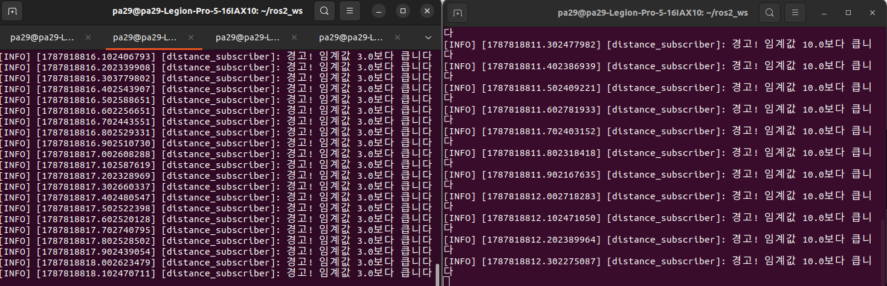
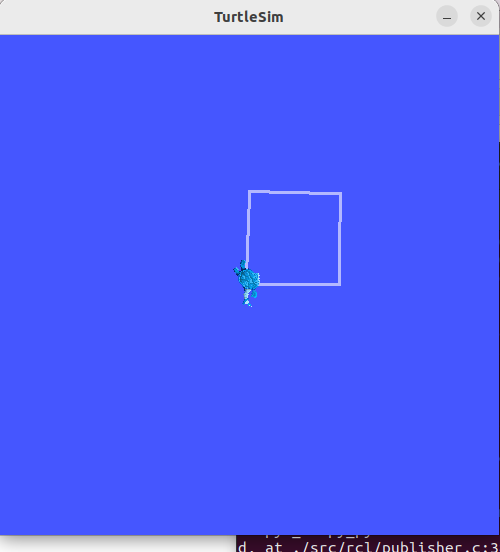
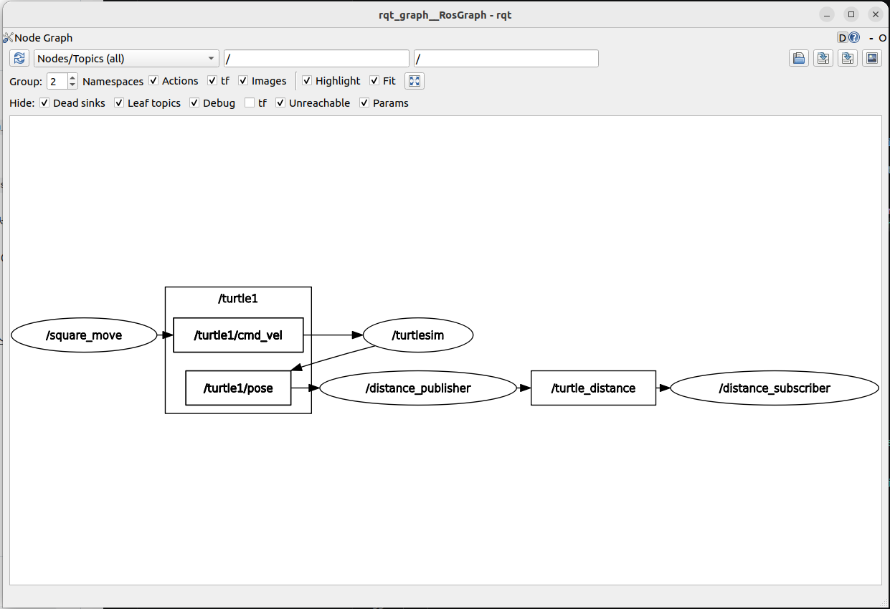
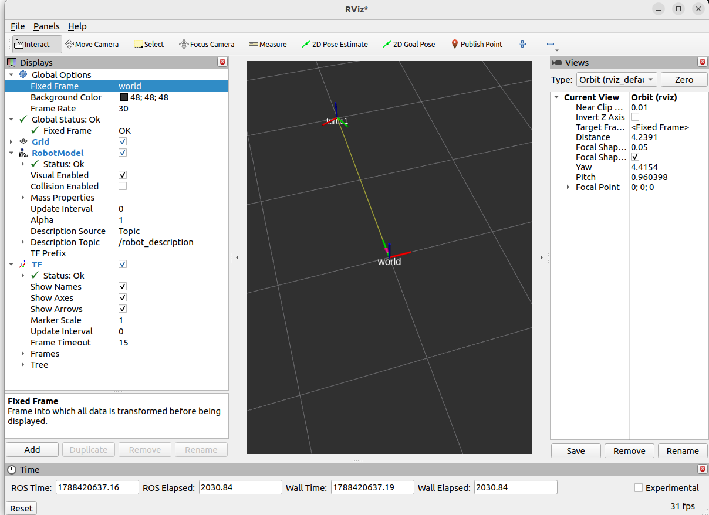

# 모듈 2

## **문제1. C++ 빌드 체계 세우기 - g++ 다중 빌드와 CMake 전환**
### **1.1. 수동 2단계 빌드 명령**

```
g++ -Wall -std=c++17 -c main.cpp motor.cpp
g++ -Wall -std=c++17 main.o motor.o -o my_motor
```

### **1.2 undefined reference 에러 메시지**

```
<undefined reference 에러>
/usr/bin/ld: main.o: in function `main':
main.cpp:(.text+0x51): undefined reference to `motor::motor(std::__cxx11::basic_string<char, std::char_traits<char>, std::allocator<char> >)'
/usr/bin/ld: main.cpp:(.text+0x7a): undefined reference to `motor::~motor()'
collect2: error: ld returned 1 exit status
```

```
<컴파일 에러>
motor.cpp: In constructor ‘motor::motor(std::string)’:
motor.cpp:6:51: error: expected ‘;’ before ‘}’ token
    6 |     std::cout << motor_name << "생성" << std::endl
      |                                                   ^
      |                                                   ;
    7 | }
      | ~                                                  
```
- 컴파일 에러는 소스코드를 기계어로 번역할 때 문법같은 것이 틀리면 나타난다.
- 링크 에러(undefined reference)는 링크를 할 때 원래 컴파일 시에 만든 설계도에서 참조해야할 파일이 빠졌을 때 나타난다.

### **1.3 CMake 빌드 출력**

```
pa29@pa29-Legion-Pro-5-16IAX10:~/ros2_ws/src/motor/build$ cmake ..
-- The C compiler identification is GNU 11.4.0
-- The CXX compiler identification is GNU 11.4.0
-- Detecting C compiler ABI info
-- Detecting C compiler ABI info - done
-- Check for working C compiler: /usr/bin/cc - skipped
-- Detecting C compile features
-- Detecting C compile features - done
-- Detecting CXX compiler ABI info
-- Detecting CXX compiler ABI info - done
-- Check for working CXX compiler: /usr/bin/c++ - skipped
-- Detecting CXX compile features
-- Detecting CXX compile features - done
-- Configuring done
-- Generating done
-- Build files have been written to: /home/pa29/ros2_ws/src/motor/build

pa29@pa29-Legion-Pro-5-16IAX10:~/ros2_ws/src/motor/build$ make
[ 33%] Building CXX object CMakeFiles/my_motor.dir/main.cpp.o
[ 66%] Building CXX object CMakeFiles/my_motor.dir/motor.cpp.o
[100%] Linking CXX executable my_motor
[100%] Built target my_motor

pa29@pa29-Legion-Pro-5-16IAX10:~/ros2_ws/src/motor/build$ ls
CMakeCache.txt  CMakeFiles  cmake_install.cmake  Makefile  my_motor
```

### **1.4 증분 빌드 시 재컴파일된 파일**

motor.cpp만 재컴파일 된다.
```
Consolidate compiler generated dependencies of target my_motor
[ 33%] Building CXX object CMakeFiles/my_motor.dir/motor.cpp.o
[ 66%] Linking CXX executable my_motor
[100%] Built target my_motor
```
판단 근거: 입력 파일과 출력파일의 타임스탬프나 해시값을 비교해서 판단한다.

## **문제2. 현대 C++로 센서 계층 구현 — RAII·다형성·STL**
### **2.1. 다형성 루프 출력**
```
idar 데이터 읽기
Imu 데이터 읽기
객체 소멸 시작
Lidar 소멸
Sensor 소멸
Imu 소멸
Sensor 소멸
```
### **2.2. 스택 객체와 힙 객체의 소멸 시점**

```
idar 데이터 읽기
Imu 데이터 읽기
객체 소멸 시작
Lidar 소멸
Sensor 소멸
Imu 소멸
Sensor 소멸
```
둘다 {} 스코프가 끝날 때 객체가 소멸한다.

### **2.3. 가상 소멸자를 뺐을 때 차이**
```
idar 데이터 읽기
Imu 데이터 읽기
객체 소멸 시작
Lidar 소멸
Sensor 소멸
Imu 소멸
Sensor 소멸
```
```
Lidar 데이터 읽기
Imu 데이터 읽기
객체 소멸 시작
Sensor 소멸
Sensor 소멸
```
Lidar소멸과 Imu 소멸이 사라진 결과를 볼 수 있다.
### **2.4. count_if 결과**
```
원래 속도: 150 clamp 속도: 120
원래 픽셀: -30 clamp 픽셀: 0
전방 최근 측정값: 0.45
후방 최근 측정값: 1.2
0.35이내 거리(count_if): 1
Lidar 데이터 읽기
Imu 데이터 읽기
객체 소멸 시작
Sensor 소멸
Sensor 소멸
```

### **2.5. 누수 검출 결과**

```
pa29@pa29-Legion-Pro-5-16IAX10:~/ros2_ws/src/cpp_basics/sensors$ valgrind --leak-check=full ./leak
==18916== Memcheck, a memory error detector
==18916== Copyright (C) 2002-2017, and GNU GPL'd, by Julian Seward et al.
==18916== Using Valgrind-3.18.1 and LibVEX; rerun with -h for copyright info
==18916== Command: ./leak
==18916== 
객체 누수 실험
프로그램 종료(메모리 해제 안함)
==18916== 
==18916== HEAP SUMMARY:
==18916==     in use at exit: 4,000 bytes in 10 blocks
==18916==   total heap usage: 12 allocs, 2 frees, 77,728 bytes allocated
==18916== 
==18916== 4,000 bytes in 10 blocks are definitely lost in loss record 1 of 1
==18916==    at 0x484A2F3: operator new[](unsigned long) (in /usr/libexec/valgrind/vgpreload_memcheck-amd64-linux.so)
==18916==    by 0x1091E7: createLeak() (leak.cpp:8)
==18916==    by 0x10923A: main (leak.cpp:16)
==18916== 
==18916== LEAK SUMMARY:
==18916==    definitely lost: 4,000 bytes in 10 blocks
==18916==    indirectly lost: 0 bytes in 0 blocks
==18916==      possibly lost: 0 bytes in 0 blocks
==18916==    still reachable: 0 bytes in 0 blocks
==18916==         suppressed: 0 bytes in 0 blocks
==18916== 
==18916== For lists of detected and suppressed errors, rerun with: -s
==18916== ERROR SUMMARY: 1 errors from 1 contexts (suppressed: 0 from 0)
```
definitely lost가 4000bytes라고 나온다.

```
==19393== Memcheck, a memory error detector
==19393== Copyright (C) 2002-2017, and GNU GPL'd, by Julian Seward et al.
==19393== Using Valgrind-3.18.1 and LibVEX; rerun with -h for copyright info
==19393== Command: ./leak
==19393== 
객체 누수 실험
프로그램 종료
==19393== 
==19393== HEAP SUMMARY:
==19393==     in use at exit: 0 bytes in 0 blocks
==19393==   total heap usage: 12 allocs, 12 frees, 77,728 bytes allocated
==19393== 
==19393== All heap blocks were freed -- no leaks are possible
==19393== 
==19393== For lists of detected and suppressed errors, rerun with: -s
==19393== ERROR SUMMARY: 0 errors from 0 contexts (suppressed: 0 from 0)
```

All heap blocks were freed -- no leaks are possible(모든 힙 블록이 해제됨 -- 누수없음) 라고 나온다.

## **문제3. rclpy 노드 작성 — 거북이 상태 발행자와 구독자**
### **3.1. /turtle1/pose 필드 구성**
x: 5.544444561004639
y: 5.544444561004639
theta: 0.0
linear_velocity: 0.0
angular_velocity: 0.0
### **3.2 ros2 topic hz /turtle_distance 출력**
평균: 10Hz
```
average rate: 10.000
	min: 0.100s max: 0.100s std dev: 0.00005s window: 11
average rate: 10.000
	min: 0.100s max: 0.100s std dev: 0.00007s window: 22
average rate: 10.000
	min: 0.100s max: 0.100s std dev: 0.00008s window: 32
average rate: 10.000
	min: 0.100s max: 0.100s std dev: 0.00008s window: 43
average rate: 10.000
	min: 0.100s max: 0.100s std dev: 0.00008s window: 54
average rate: 10.000
	min: 0.100s max: 0.100s std dev: 0.00008s window: 65
```
### **3.3. 구독자 경고 로그**
```
[INFO] [1787818459.002631350] [distance_subscriber]: 경고! 임계값 3.0보다 큽니다
[INFO] [1787818459.102789962] [distance_subscriber]: 경고! 임계값 3.0보다 큽니다
[INFO] [1787818459.202813160] [distance_subscriber]: 경고! 임계값 3.0보다 큽니다
[INFO] [1787818459.302520609] [distance_subscriber]: 경고! 임계값 3.0보다 큽니다
[INFO] [1787818459.402659761] [distance_subscriber]: 경고! 임계값 3.0보다 큽니다
[INFO] [1787818459.502615802] [distance_subscriber]: 경고! 임계값 3.0보다 큽니다
[INFO] [1787818459.602652450] [distance_subscriber]: 경고! 임계값 3.0보다 큽니다
[INFO] [1787818459.702606439] [distance_subscriber]: 경고! 임계값 3.0보다 큽니다
[INFO] [1787818459.802619749] [distance_subscriber]: 경고! 임계값 3.0보다 큽니다
[INFO] [1787818459.902837751] [distance_subscriber]: 경고! 임계값 3.0보다 큽니다
[INFO] [1787818460.002541561] [distance_subscriber]: 경고! 임계값 3.0보다 큽니다
```

### **3.4 구독자 2개 동시 수신 확인(양쪽 로그)**


### **3.5. 정사각형 주행 캡처**


### **3.6. 정상 종료 화면**
```
pa29@pa29-Legion-Pro-5-16IAX10:~/ros2_ws$ ros2 run turtle_py pub
^C[INFO] [1787819943.140597888] [distance_publisher]: DistancePublisher 노드 종료.

^C[INFO] [1787819975.350596471] [distance_subscriber]: DistanceSubscriber 노드 종료

pa29@pa29-Legion-Pro-5-16IAX10:~/ros2_ws$ ros2 run turtle_py square 
^C[INFO] [1787819882.746558117] [square_move]: SquareMove 노드 종료

```

## **문제4. rclcpp 노드 작성 — C++ 발행자와 구독자**
### **4.1. colcon build 성공 출력**
```
pa29@pa29-Legion-Pro-5-16IAX10:~/ros2_ws$ colcon build --packages-select turtle_cpp
Starting >>> turtle_cpp
Finished <<< turtle_cpp [2.14s]                     

Summary: 1 package finished [2.28s]
```

### **4.2 rclpy발행에서 rclcpp구독으로 이어진 로그**

```
<rclpy>
pa29@pa29-Legion-Pro-5-16IAX10:~/ros2_ws$ ros2 run turtle_py pub 

```
```
<rclcpp>
pa29@pa29-Legion-Pro-5-16IAX10:~/ros2_ws$ ros2 run turtle_cpp sub --ros-args -p warn_distance:=10.0
[INFO] [1787883009.628644139] [distance_subscriber]: 경고! 임계값 10.0보다 큽니다
[INFO] [1787883009.728693037] [distance_subscriber]: 경고! 임계값 10.0보다 큽니다
[INFO] [1787883009.828659957] [distance_subscriber]: 경고! 임계값 10.0보다 큽니다
[INFO] [1787883009.928982726] [distance_subscriber]: 경고! 임계값 10.0보다 큽니다

```
### **4.3. rclpy와 rclcpp 대응 관계표**
||rclpy|rclcpp|
|---|---|---|
|노드생성|rclpy.init()<br>class MyNode(Node):<br>def __init__(self):<br>super().__init__('my_node')<br>node=MyNode()|rclcpp::init(argc,argv)<br>class MyNode:public rclcpp::Node{};<br>public:MyNode():Node("my_node");<br>auto node = std::make_shared<MyNode>();|
|타이머|self.timer = self.create_timer(1.0,self.timer_callback)|timer_=this->create_wall_timer(1s,std::bind(&MyNode::timer_callback,this));|
|콜백|def timer_callback(self):<br>def pose_callback(self,msg)|private:<br>void timer_callback()<br>private:<br>void pose_callback(const turtlesim::msg::Pose::SharedPtr msg)|
|종료|rclpy는 rclpy.init(signal_handler_options=SignalHandlerOptions.NO)로 처리를 해줘야 rclpy가 ctrl C를 처리를 안하고 KeyboardInterrupt로 넘어가게 해서 강제종료가 아닌 정상종료가 될 수 있다.<br>try:<br>rclpy.spin(node)<br>except KeyboardInterrupt<br>finally:<br>node.destroy_node()<br>rclpy.shutdown()|rclcpp::spin(node);<br>그냥 ctrl C 입력<br>rclcpp::shutdown()정상종료|

## **문제 10. 시각화·기록·테스트로 검증하기**
### **문제 10.1. rqt_graph 캡처, 데이터 미수신 진단 절차**
<캡쳐>


1. 노드 생존 여부 확인
```
ros2 node list
```
2. 토픽 목록 및 실제 발행 여부 확인 
```
ros2 topic list
ros2 topic echo /turtle_distance
```
3. 상위 의존 토픽 점검
```
ros2 topic echo /turtle1/pose
```
4. 토픽 정보 및 QoS 호환성 확인
```
ros2 topic info /turtle_distance --verbose
```
5. 도메인 ID(ROS_DOMAIN_ID) 확인
```
echo $ROS_DOMAIN_ID
```

### **문제 10.2. RViz2 TF + 경유점 마커 캡처**


### **문제 10.3. ros2 bag play 재생 중 구독자 로그**
```
[INFO] [1788421410.610399020] [rosbag2_recorder]: Subscribed to topic '/turtle_distance'
[INFO] [1788421410.611011088] [rosbag2_recorder]: Subscribed to topic '/turtle1/pose'
```
### **문제 10.4. pytest 통과 출력**
```
=================================== test session starts ====================================
platform linux -- Python 3.10.12, pytest-7.4.4, pluggy-1.6.0 -- /home/pa29/lv1_module3/.venv/bin/python3
cachedir: .pytest_cache
rootdir: /home/pa29/ros2_ws/src/turtle_py
plugins: anyio-4.14.2
collected 9 items                                                                          

test/test_geometry_utils.py::test_distance_normal PASSED                             [ 11%]
test/test_geometry_utils.py::test_distance_boundary PASSED                           [ 22%]
test/test_geometry_utils.py::test_distance_exception PASSED                          [ 33%]
test/test_geometry_utils.py::test_angle_normal PASSED                                [ 44%]
test/test_geometry_utils.py::test_angle_boundary PASSED                              [ 55%]
test/test_geometry_utils.py::test_angle_exception PASSED                             [ 66%]
test/test_geometry_utils.py::test_waypoint_normal PASSED                             [ 77%]
test/test_geometry_utils.py::test_waypoint_boundary PASSED                           [ 88%]
test/test_geometry_utils.py::test_waypoint_exception PASSED                          [100%]

==================================== 9 passed in 0.01s =====================================
```
작성한 테스트 3개 의도: 
- calculate_distance_to_goal: 피타고라스 정리를 통한 2D 유클리드 거리 연산 정확성 검증
- normalize_angle_to_goal: atan2 기반의 조향각 계산 시 로봇 회전 제어기가 처리하기 쉬운 −π~π범위로 각도 정규화 되는지
- is_waypoint_reached: 오차 범위 내 진입 여부 판정 로직 테스트

### **문제 10.5. 함수 틀리게 바꿨을 때 실패 출력**
```
=================================== test session starts ====================================
platform linux -- Python 3.10.12, pytest-7.4.4, pluggy-1.6.0 -- /home/pa29/lv1_module3/.venv/bin/python3
cachedir: .pytest_cache
rootdir: /home/pa29/ros2_ws/src/turtle_py
plugins: anyio-4.14.2
collected 9 items                                                                          

test/test_geometry_utils.py::test_distance_normal PASSED                             [ 11%]
test/test_geometry_utils.py::test_distance_boundary PASSED                           [ 22%]
test/test_geometry_utils.py::test_distance_exception PASSED                          [ 33%]
test/test_geometry_utils.py::test_angle_normal PASSED                                [ 44%]
test/test_geometry_utils.py::test_angle_boundary PASSED                              [ 55%]
test/test_geometry_utils.py::test_angle_exception PASSED                             [ 66%]
test/test_geometry_utils.py::test_waypoint_normal FAILED                             [ 77%]
test/test_geometry_utils.py::test_waypoint_boundary FAILED                           [ 88%]
test/test_geometry_utils.py::test_waypoint_exception PASSED                          [100%]

========================================= FAILURES =========================================
___________________________________ test_waypoint_normal ___________________________________

    def test_waypoint_normal():
        """정상 케이스: 명확히 안쪽 또는 바깥쪽인 경우"""
>       assert is_waypoint_reached(distance=0.05, tolerance=0.1) is True
E       assert False is True
E        +  where False = is_waypoint_reached(distance=0.05, tolerance=0.1)

test/test_geometry_utils.py:72: AssertionError
__________________________________ test_waypoint_boundary __________________________________

    def test_waypoint_boundary():
        """경계값 케이스: 허용 오차와 정확히 일치할 때(True), 0일 때"""
        # 거리가 허용 오차 경계값과 정확히 같을 때 도달(True) 판정이어야 함
>       assert is_waypoint_reached(distance=0.1, tolerance=0.1) is True
E       assert False is True
E        +  where False = is_waypoint_reached(distance=0.1, tolerance=0.1)

test/test_geometry_utils.py:79: AssertionError
================================= short test summary info ==================================
FAILED test/test_geometry_utils.py::test_waypoint_normal - assert False is True
FAILED test/test_geometry_utils.py::test_waypoint_boundary - assert False is True
=============================== 2 failed, 7 passed in 0.04s ================================
```

### **문제 10.6. 예외처리, logging 동작 확인**
```
(.venv) pa29@pa29-Legion-Pro-5-16IAX10:~/ros2_ws$ ros2 run turtle_py tf --ros-args -p publish_rate:=0.0
[WARN] [1788423082.807060782] [turtle_tf_and_marker_node]: 잘못된 publish_rate(0.0)가 입력되었습니다! 기본값 1.0Hz를 적용합니다.
```